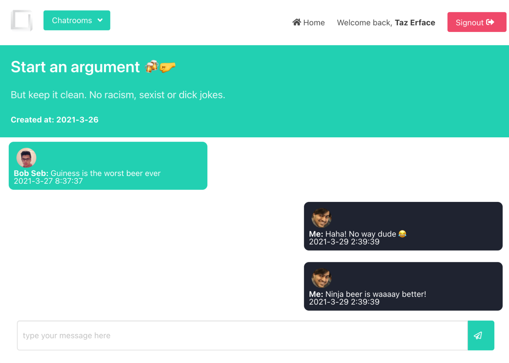

<p align="center">
  
</p>

## About

Yggdrasil is a (currently pre-beta) public chatroom created using CRA powered by Firebase.

## What can you do with it?

You can enter a chatroom or create one yourself. But there are restrictions for each user (mostly due to me being cheap and hosting the Database on a free tier plan so I don't have a lot of storage for now)

<a align="center">

</a>

## Installation

1. First you need to set up Firebase. Please refer to the following docs before running the app:

- [Firebase settings](./docs/FIREBASE_SETTINGS.md)
- [Schema settings](./docs/SCHEMA.md)

2. Install and start the local server

```bash
yarn && yarn start
```

3. Access http://localhost:3000

## TODO

- Unit & E2E tests

As this is a PoC app, I haven't really begun adding tests (yet). If you would like to contribute, feel free to send a pull request :)
